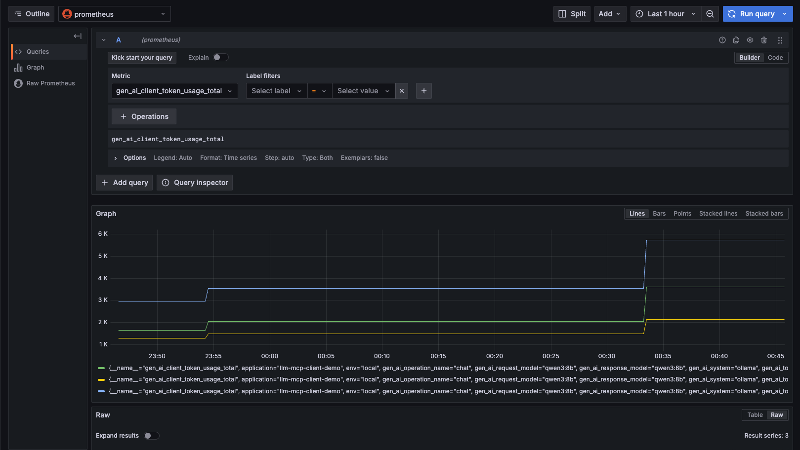
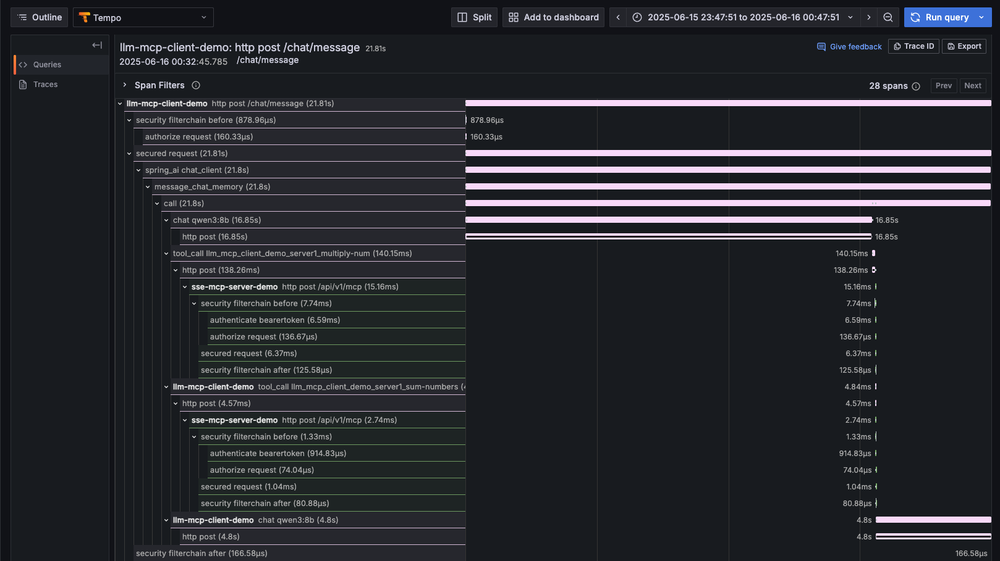
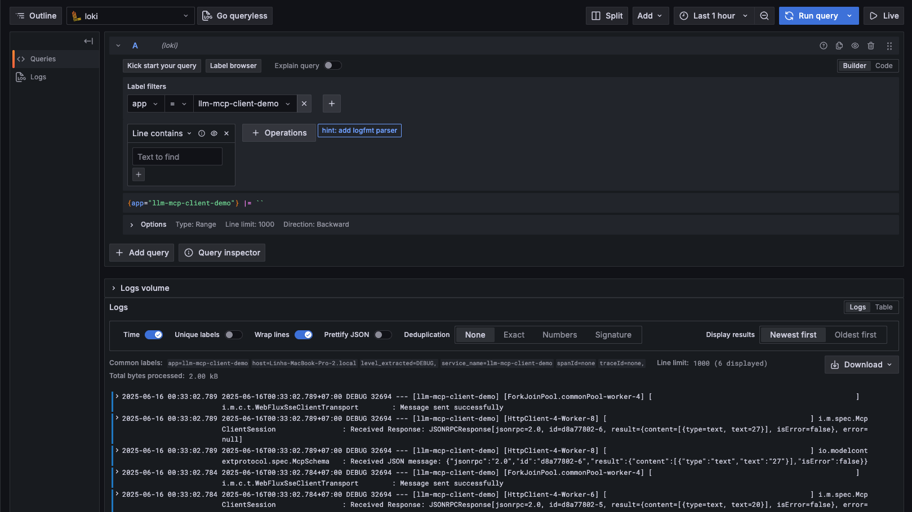

# LLM SSE MCP with Observability (Prometheus/Metrics, Tempo/Traces, Loki/Logs, Grafana)

This project demonstrates the integration between LLM clients and MCP (Model Context Protocol) servers using Server-Sent Events (SSE) for real-time communication. It consists of three Spring Boot applications that showcase OAuth 2.0 security, tool calling capabilities with various LLM models, and secure authentication services.

## Project Structure

### 1. Authorization Server Demo (`authorization-server-demo`)
A Spring Boot application that implements OAuth 2.0 authorization server functionality, providing secure authentication and authorization services.

**Features:**
- **OAuth 2.0 Authorization Server**: Issues access tokens and validates them

**Port:** 9000

### 2. SSE MCP Server Demo (`sse-mcp-server-demo`)
A Spring Boot application that serves as an MCP server, exposing mathematical and date/time tools via SSE endpoints.

**Features:**
- **Math Tools**: Addition and multiplication operations
- **DateTime Tools**: Current time retrieval and alarm setting
- **SSE Support**: Real-time communication via Server-Sent Events
- **MCP Protocol**: Implements Model Context Protocol for tool discovery and execution

**Available Tools:**
- `sumNumbers(int, int)` - Adds two numbers
- `multiplyNumbers(int, int)` - Multiplies two numbers
- `getCurrentDateTime()` - Gets current date/time in user's timezone
- `setAlarm(String)` - Sets an alarm for specified ISO-8601 time

**Port:** 8080 (default)

### 3. LLM MCP Client Demo (`llm-mcp-client-demo`)
A Spring Boot web application that connects to the MCP server and provides an interactive chat interface with multiple LLM providers.

**Features:**
- **Multiple LLM Support**: Anthropic Claude, OpenAI GPT, Google Gemini, Ollama
- **Interactive Web Chat**: Real-time chat interface using Thymeleaf
- **MCP Integration**: Connects to SSE MCP server for tool calling
- **Tool Discovery**: Automatically discovers and uses available tools from MCP server

**Supported LLM Models:**
- **Anthropic Claude**: claude-sonnet-4-20250514
- **OpenAI**: o4-mini-2025-04-16
- **Google Gemini**: gemini-2.5-flash-preview-05-20
- **Ollama**: qwen3:8b (local)

**Port:** 10101

## Prerequisites

- Java 17 or higher
- Gradle
- API keys for cloud LLM providers (optional)
- Ollama installed locally (for local models)
- Docker & Docker Compose

## Environment Variables

For the LLM client, set the following environment variables for cloud providers:

```bash
export ANTHROPIC_API_KEY=your_anthropic_key
export OPENAI_API_KEY=your_openai_key
export GOOGLE_PROJECT_ID=your_google_project_id
export GOOGLE_ZONE=your_google_zone
```

## Quick Start

### 1. Start Prometheus, Tempo, Loki, Grafana
```bash
docker compose up -d
```

### 2. Start the Authorization Server
```bash
cd authorization-server-demo
./gradlew bootRun
```

### 3. Start the MCP Server
```bash
cd sse-mcp-server-demo
./gradlew bootRun
```

### 4. Start the LLM Client
```bash
cd llm-mcp-client-demo
./gradlew bootRun
```

### 5. Access the Chat Interface
Open your browser and navigate to: `http://localhost:10101`

### 6. Access Grafana and explore Prometheus, Tempo, Loki
Open your browser and navigate to: `http://localhost:3000`

> `Data sources` -> `Prometheus` -> `Explore`


> `Data sources` -> `Tempo` -> `Explore`


> `Data sources` -> `Loki` -> `Explore`


## Usage

1. **Start both services** in the order specified above
2. **Open the web interface** at `http://localhost:9090`
3. **Send messages** that require mathematical operations or time queries
4. **Watch the LLM** automatically discover and use the available tools

Example queries:
- "What's 5 times 4 plus 7?"
- "What time is it?"
- "Set an alarm for 2025-01-01T10:00:00"

## Technology Stack

- **Spring Boot 3.x**
- **Spring Security OAuth2**
- **Spring AI** - LLM integration framework
- **Model Context Protocol (MCP)** - Tool discovery and execution
- **Server-Sent Events (SSE)** - Real-time communication
- **Thymeleaf** - Web templating
- **Gradle** - Build system

## Configuration

All applications use YAML configuration files:
- Authorization server configuration in `authorization-server-demo/src/main/resources/application.yml`
- MCP server configuration in `sse-mcp-server-demo/src/main/resources/application.yml`
- LLM client configuration in `llm-mcp-client-demo/src/main/resources/application.yml`

## Development

The project demonstrates:
- **MCP Protocol Implementation** using Spring AI
- **SSE-based Real-time Communication**
- **Multi-provider LLM Integration**
- **Tool Calling and Discovery**
- **Interactive Web Interfaces**
- **MCP Authorization with OAuth2**
- **Observation with Spring Actuator and Micrometer(OpenTelemetry, Prometheus, Tempo, Loki, Grafana)**

This demo serves as a foundation for building more complex LLM-powered applications with external tool capabilities.
